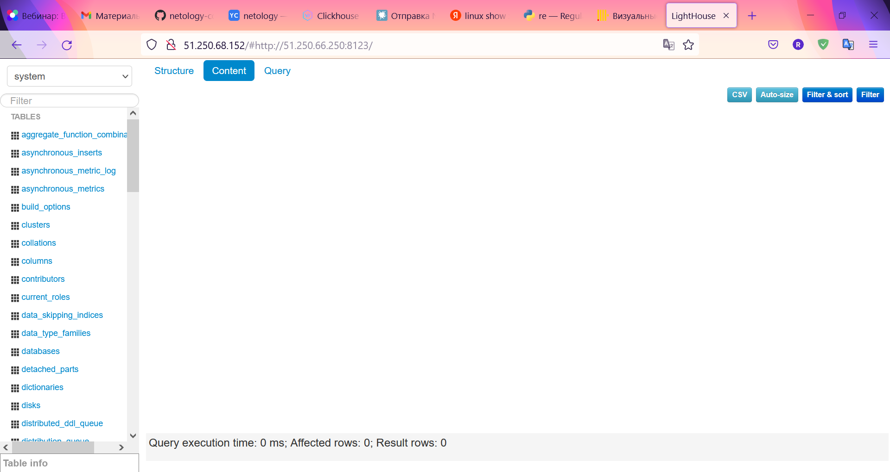

# Описание playbook

Скрипты terraform создают три ВМ `clickhouse-01`, `vector-01`, `lighthouse-01` и формируют файл `inventory/prod.yml` с параметрами подключения к ним, после выполнения команды `destroy` файл удаляется. Playbook выполняет развертывание СУБД ClickHouse, роутера событий Vector и легковесного веб-интерфейса для ClickHouse - LightHouse на ВМ.
Для настройки конфигурации ПО применяются [шаблоны Jinja](./playbook/templates/), `vector.yml` формируется из переменной `vector_config`, а в файле конфигурации `/etc/clickhouse-server/config.xml` выполняется смена ip адреса сервиса заданием `Listen specified address`

Используемые теги:

- nginx - установка пакетов и настройка web-сервера
- lighthouse - установка пакетов и настройка LightHouse
- clickhouse - установка пакетов и настройка ClickHouse
- vector - установка пакетов и настройкам Vector

